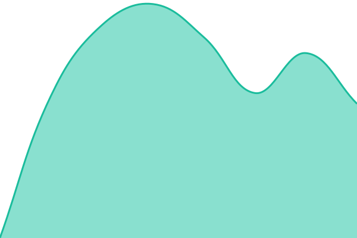

# [📈 Live Status](https://otakuemily.github.io/upptime): <!--live status--> **🟧 Partial outage**

This repository contains the open-source uptime monitor and status page for [Emily](https://otakuemily.github.io/upptime), powered by [Upptime](https://github.com/upptime/upptime).

With [Upptime](https://upptime.js.org), you can get your own unlimited and free uptime monitor and status page, powered entirely by a GitHub repository. We use [Issues](https://github.com/otakuemily/upptime/issues) as incident reports, [Actions](https://github.com/otakuemily/upptime/actions) as uptime monitors, and [Pages](https://otakuemily.github.io/upptime) for the status page.

<!--start: status pages-->
<!-- This summary is generated by Upptime (https://github.com/upptime/upptime) -->
<!-- Do not edit this manually, your changes will be overwritten -->
<!-- prettier-ignore -->
| URL | Status | History | Response Time | Uptime |
| --- | ------ | ------- | ------------- | ------ |
|  [Kemonoforge](https://forge.kemonomimi.moe) | 🟩 Up | [kemonoforge.yml](https://github.com/OtakuEmily/uptime/commits/HEAD/history/kemonoforge.yml) | 

 718ms
     
 | 

<a href="https://uptime.kemonomimi.moe/history/kemonoforge">94.58%</a>
    

|  [Kemonotrix](https://matrix.kemonomimi.moe) | 🟥 Down | [kemonotrix.yml](https://github.com/OtakuEmily/uptime/commits/HEAD/history/kemonotrix.yml) | 

 0ms
     
 | 

<a href="https://uptime.kemonomimi.moe/history/kemonotrix">0.00%</a>
    

|  [Kemonosocial](https://social.kemonomimi.moe) | 🟥 Down | [kemonosocial.yml](https://github.com/OtakuEmily/uptime/commits/HEAD/history/kemonosocial.yml) | 

 0ms
     
 | 

<a href="https://uptime.kemonomimi.moe/history/kemonosocial">0.00%</a>
    

|  [Kemonolink](https://link.kemonomimi.moe) | 🟥 Down | [kemonolink.yml](https://github.com/OtakuEmily/uptime/commits/HEAD/history/kemonolink.yml) | 

 0ms
     
 | 

<a href="https://uptime.kemonomimi.moe/history/kemonolink">0.00%</a>
    

<!--end: status pages-->

[**Visit our status website →**](https://otakuemily.github.io/upptime)

## 📄 License

- Powered by: [Upptime](https://github.com/upptime/upptime)
- Code: [MIT](./LICENSE) © [Anand Chowdhary](https://anandchowdhary.com)
- Data in the `./history` directory: [Open Database License](https://opendatacommons.org/licenses/odbl/1-0/)
